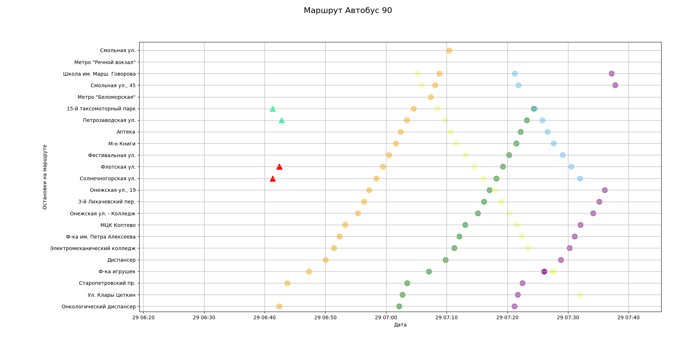
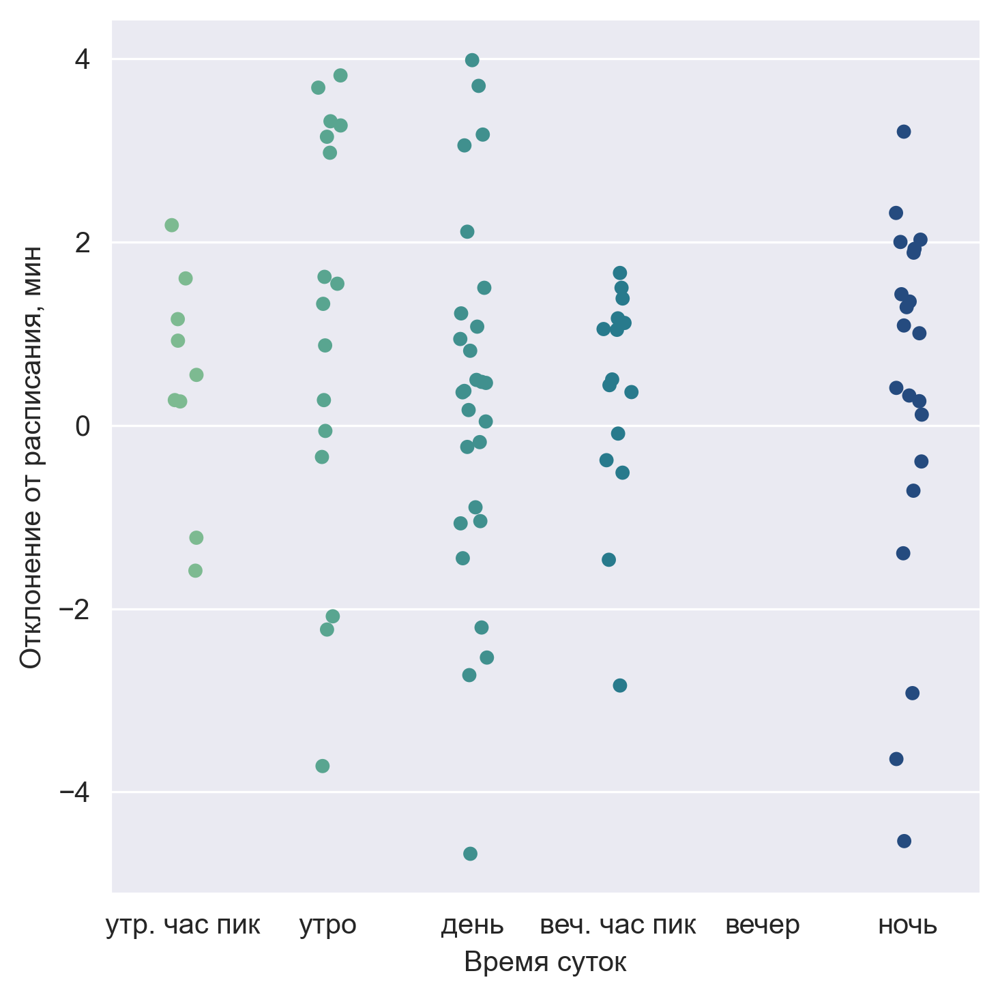
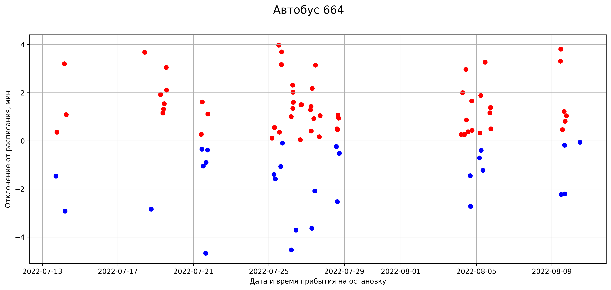
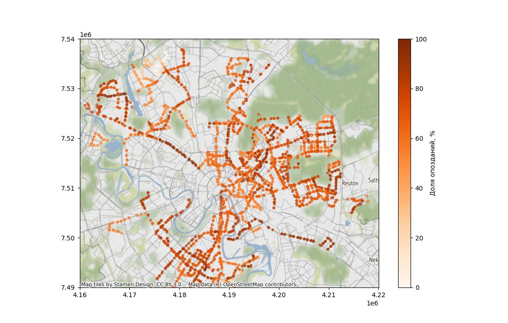

## Описание 
Данный репозиторий содержит код, необходимый для подготовки визуализаций для участия 
в Дата челлендже «Московский транспорт», проходившего (-дящего) в январе 2023 года. 

Полезные ссылки:
* [Сайт для регистрации](http://mosdatachallenge.tilda.ws/)
* [Описание датасета](https://artempankin.notion.site/a5fa5cef8ae24ee59a0e8d2ad1505549)

## Документация
Общие функции и классы помощники для визуализации и предобработки данных расположены в папке [mostra](./mostra).
Примеры того как запускать код, можно найти в папке [examples](./examples). Все необходимые пояснения и техническая 
документация содержится в Docstring. Данные, которые помещатся в git можно найти в папке [data](./data). 
Для конфигурации виртуального окружения используйте poetry: вся необходимая информация о завивимостях есть в файлах 
`poetry.lock` и `pyproject.toml` в данном репозитории

Все примеры запуска скриптов следует применять последовательно, так как некоторые из них работают довольно долго, так 
как не "векторизованы" - многие операции реализованы через итераторы. 

## Необходимые приготовления 

Перед тем как начать работу с данным репозиторием, пожалуйста, разместите в папке [data](./data)
все недостающие файлы, а именно: 
* `pred_data.csv` - исходный датасет, который предоставляют организаторы соревнования. Ссылка есть 
  на [странице в Notion](https://artempankin.notion.site/a5fa5cef8ae24ee59a0e8d2ad1505549) внизу документа.
  Рекомендуется скачать все необходимые документы из этой страницы и положить их в папку [data](./data). Но 
  обязательным считается именно pred_data.csv.
* `stop_from_repo.csv` - этот файл взят из [репозитория организаторов челленджа](https://github.com/freQuensy23-coder/moscow_tranport_stations).
Называется "stop.csv", прямая ссылка на него [здесь](https://github.com/freQuensy23-coder/moscow_tranport_stations/blob/main/stop.csv). 
  Файл небольшой, поэтому хранится в системе контроля версий и текущего репозитория, но при необходимости можно взять данные
  по приведенной выше ссылке.

Поздравляю, теперь вы готовы использовать алгоритмы для визуализации и предобработки данных в данном модуле! Чтобы
разобраться как что запускать и к чему это приведет, используйте пояснения ниже.

## Примеры запуска

Внимание: нужно следить за тем какие таблицы каким файлом обрабатываются. Для полного воспроизведения пайплайна обработки
следует запскать все указанные ниже скрипты последовательно. 

В папке [examples](./examples) можно найти следующие примеры:

* [slide_2_stops_map.py](./examples/slide_2_stops_map.py) - визуализирует на карте Москвы как расположены остановки, 
  попавшие в выборку.
  Генерируемая картинка должна выглядеть следующим образом:
  
  

* [slide_3_route_with_stops_raw.py](./examples/slide_3_route_with_stops_raw.py) - визуализация исходного датафрейма `pred_data.csv`, где остановки 
упорядочиваются (приблизительно) в порядке движения транспорта по маршруту и затем наносятся на ось y. 
  Картинки с визуализациями строятся отдельно для каждого маршрута. Поскольку маршрутов много, то картинки 
  сохраняются в указанную директорию. 
  Пример генерируемой картинки (синим цветом показаны данные расписания, красным - прибыте транспорта 
  по телеметрическим данным). Расстояния между названиями остановок пропорциональны дистанции между
  остановками в действительности. Цвет надписей в названиях остановок отвечает за визуализацию направления движения:
  
  

* [slide_4_route_with_stops_preprocessed.py](./examples/slide_4_route_with_stops_preprocessed.py) - скрипт генериует
  точно такие же графики как и выше, но использует для этого предобработанные данные. В предобработку входит операция
  агрегирования временных меток прибытия транспорта на остановку по расписанию
  Пример генерируемой картинки (синим цветом показаны данные расписания, красным - прибыте транспорта 
  по телеметрическим данным):
  
  

* [slide_5_route_with_stops_comparison.py](./examples/slide_5_route_with_stops_comparison.py) - скрипт генериует
  графики похожие на те что выше, но выделяет отдельный транспорт цветом (по tmId)
  Пример генерируемой картинки (кружками показаны данные расписания, треугольниками - прибыте транспорта 
  по телеметрическим данным (остаются только достоверные данные), цветом показаны различные по tmId транспортные 
  средства):
  
  

* [slide_6_calculate_arrival_time.py](./examples/slide_6_calculate_arrival_time.py) - скрипт для расчета 
  фактического времени прибытия транспортного средства на остановку. Визуализаций не предусмотрено.
  
* [slide_6_7_actual_arrival_transport_at_stop.py](./examples/slide_6_7_actual_arrival_transport_at_stop.py) - визуализация 
разницы фактического времени прибытия транспорта и ожидаемого времени прибытия по расписанию.
  Пример генерируемых картинок для автобуса 664: 
  
  |   |   |
  |---|---|
  
* [slide_8_actual_time_map.py](./examples/slide_8_actual_time_map.py) - финальные визуализации на картах, где для
  отлельно выбранных маршрутов строятся карто-схемы с оценками того насколько часто и насколько сильно опаздывает 
  транспорт в этих локациях. Внимание - от гиперпараметров на предыдущих шагах очень 
  сильно зависит финальный результат (и финальные визуализации). 
  Пример визуализации:
  
  